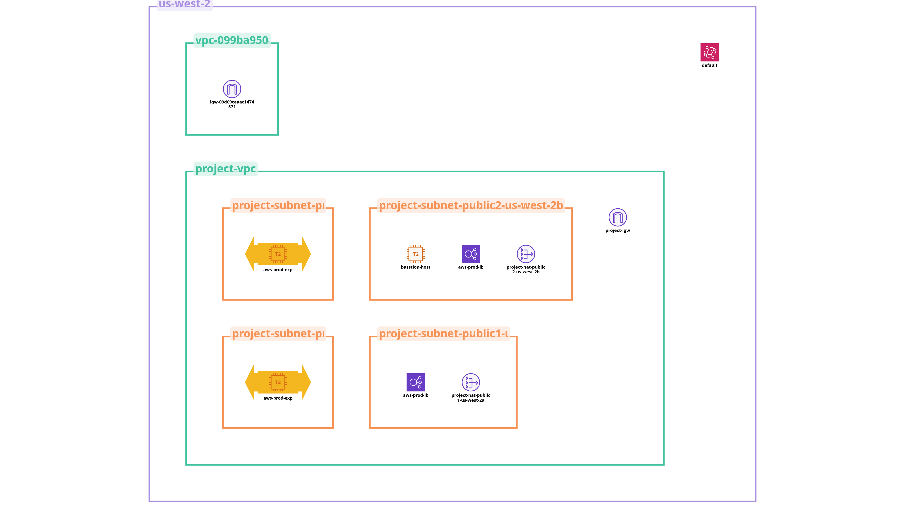
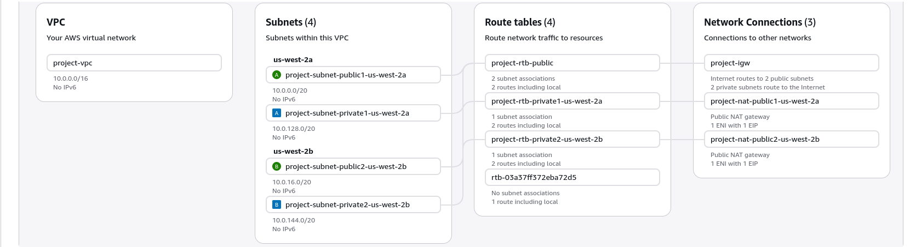
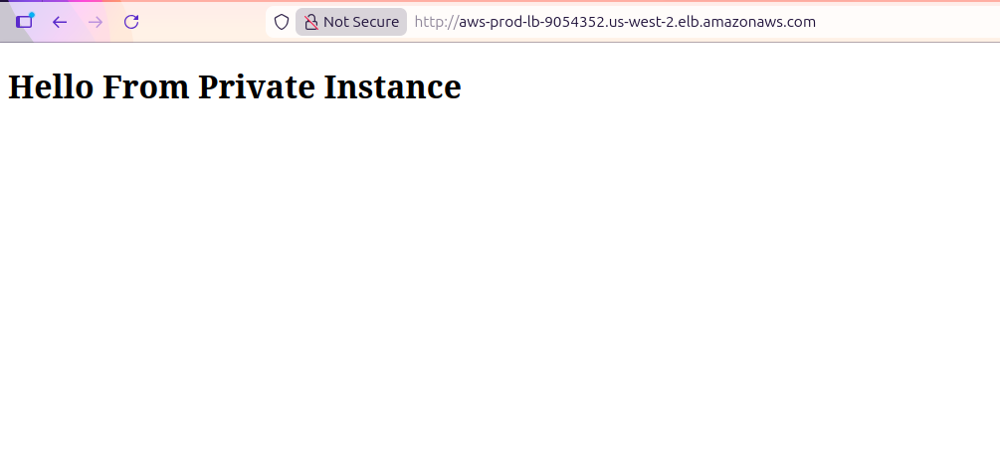
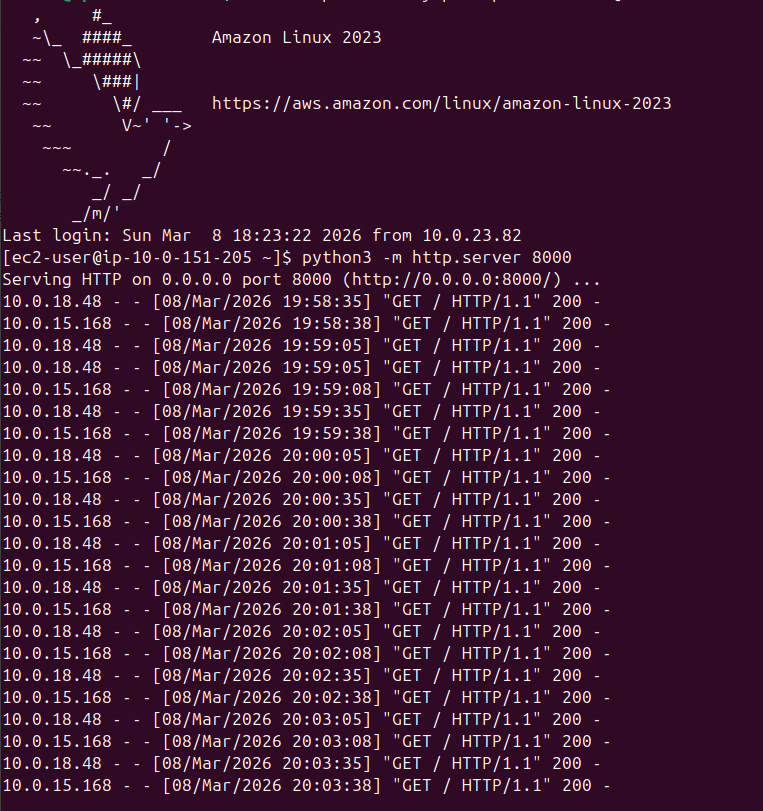

# AWS VPC private subnet architecture
implemented a production-grade AWS architecture that deploys applications securely inside a private subnet.
## architecture overview

how traffic flows
- **inbound:** user → internet gateway → ALB → EC2 instances (private subnet)
- **outbound:** EC2 instances → NAT gateway → internet gateway → internet
- **admin SSH:** my machine → bastion host → EC2 instances (private subnet)
## what i built
1. **VPC** — isolated network for all my resources
2. **public subnets (x2)** — where i placed the ALB and NAT gateway, one per AZ
3. **private subnets (x2)** — where my application EC2 instances live, one per AZ
4. **internet gateway** — allows public internet traffic into the VPC
5. **NAT gateway** — lets private instances reach the internet without exposing their IPs
6. **application load balancer** — distributes incoming HTTP traffic across my EC2 instances
7. **auto scaling group** — automatically manages and scales my EC2 instances
8. **bastion host** — jump server i used to SSH into private instances
9. **security groups** — firewall rules i configured per resource
## how i set this up
### 1. created the VPC
i used the VPC wizard to create:
- 2 public subnets and 2 private subnets across `us-east-1a` and `us-east-1b`
- 1 NAT gateway
- route tables automatically attached to subnets

### 2. created a launch template
- AMI: ubuntu
- instance type: `t2.micro`
- security group with port `22` (SSH) and `8000` (app)
### 3. created an auto scaling group
- used the launch template above
- deployed instances into private subnets only
- desired: 2, min: 2, max: 4
### 4. set up the bastion host
i launched a separate EC2 instance in the public subnet to use as a jump server to reach my private instances.
### 5. deployed the app via bastion
```bash
# copy my .pem key to the bastion host
scp -i aws-login.pem aws-login.pem ubuntu@<BASTION_PUBLIC_IP>:~
# SSH into bastion
ssh -i aws-login.pem ubuntu@<BASTION_PUBLIC_IP>
# from bastion, SSH into private EC2 (the AMI was different)
ssh -i aws-login.pem ec2-user@<PRIVATE_EC2_IP>
# deploy a simple python HTTP server on port 8000
echo "<h1>my first AWS project</h1>" > index.html
python3 -m http.server 8000
```
### 6. created the application load balancer
- scheme: internet-facing, placed in both public subnets
- security group: port `80` open from `0.0.0.0/0`
- target group pointing to my EC2 instances on port `8000`

### 7. tested it
i copied the ALB DNS name and opened it in the browser — the HTML page loaded successfully.

---
## security decisions i made
- my EC2 instances have no public IPs — completely unreachable directly from the internet
- all user traffic enters only through the ALB
- outbound traffic from private instances goes through NAT gateway so their IPs are never exposed
- SSH access is only possible through the bastion host, keeping access auditable and controlled
- security groups follow least privilege — only the ports each resource actually needs are open
